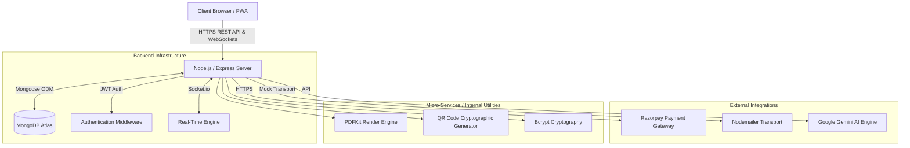
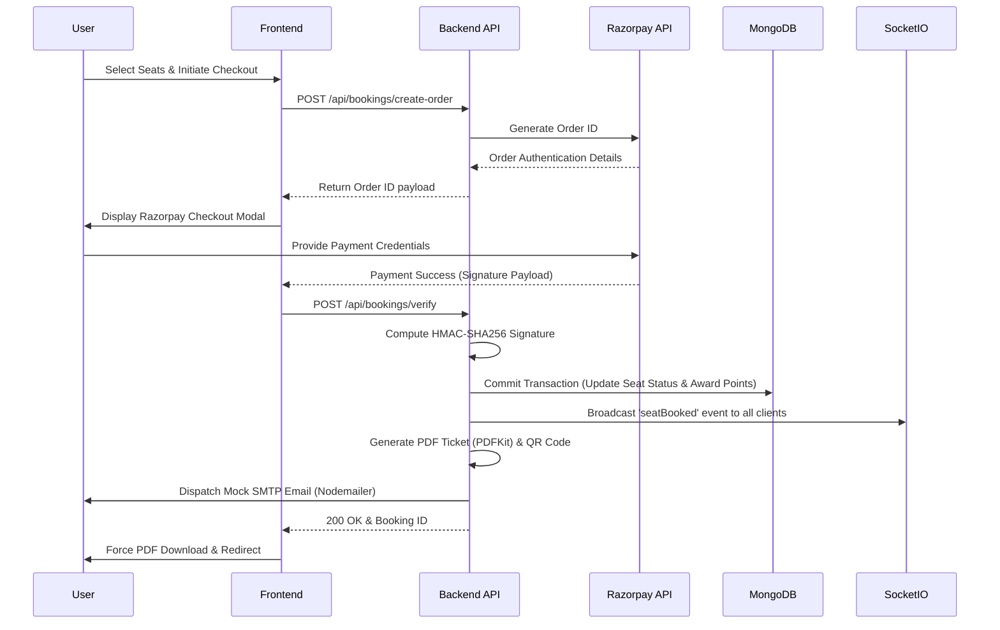
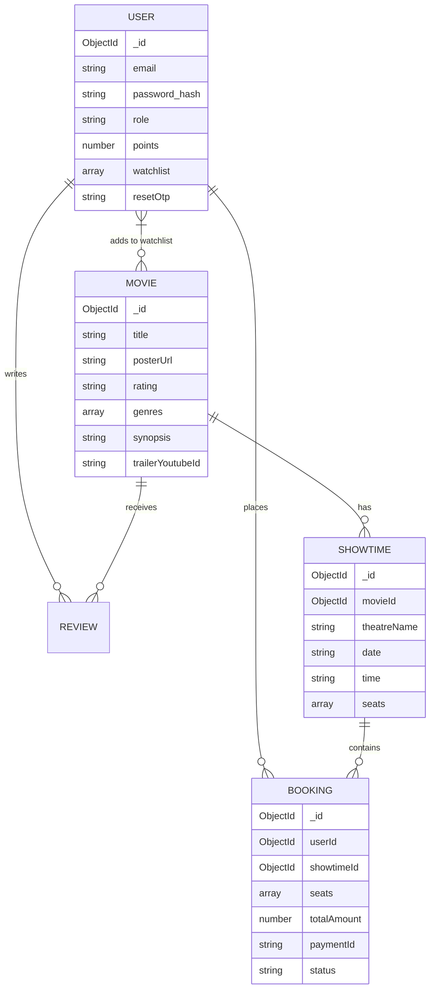

# CINEMAX: Enterprise Movie Ticketing Platform

**ACA Summer Project End Evaluation: ACA253**

CINEMAX is a highly scalable, robust, and enterprise-grade movie ticketing and theater management platform. Developed as the definitive capstone for the ACA summer project end evaluation, this system demonstrates mastery over advanced software engineering principles, full-stack JavaScript development, real-time WebSockets, Progressive Web Apps (PWA), cryptographic security, and complex integrations with modern third-party APIs.

---

## 1. Executive Summary

The CINEMAX platform is engineered to handle high-concurrency booking transactions while maintaining strict ACID compliance at the database level. It abstracts the complexity of theater seat management, secure payment processing, automated document generation, real-time seating synchronization, gamification, and personalized content delivery into a seamless, high-performance web interface.

---

## 2. Architectural Topology

The system adheres to a strictly decoupled Client-Server architecture, ensuring high cohesion and low coupling. 

### 2.1 System Architecture


### 2.2 Transaction Sequence Flow
The booking engine handles concurrency and payment validation securely without exposing sensitive keys to the client.



---

## 3. Database Schema Design

The application utilizes MongoDB Atlas with a strictly typed schema using Mongoose. 



---

## 4. Security & Authentication Protocol

Security is implemented at multiple layers of the application stack:

1. **Authentication:** Stateless authentication utilizing JSON Web Tokens (JWT).
2. **Role-Based Access Control (RBAC):** Admin endpoints are strictly protected by `isAdmin` middleware. Users can be promoted to admins using a secret token.
3. **Password Cryptography:** All user credentials are computationally hashed using `bcryptjs`.
4. **Payment Integrity:** Razorpay webhooks and client callbacks are verified server-side using cryptographic HMAC-SHA256 signatures.
5. **Route Protection:** Express middleware intercepts protected routes, verifying the Authorization Bearer token before proceeding to the controller logic.

---

## 5. RESTful API Documentation

### User Identity & Gamification
- `POST /api/users/signup`: Registers a new user and hashes credentials.
- `POST /api/users/signin`: Authenticates credentials and issues a JWT.
- `GET /api/users/me`: Fetches user profile including **Gamification Points**.
- `POST /api/admin/promote`: Promotes a user to 'admin' role using an environment secret.

### Movie & Content Delivery
- `GET /api/movies?genre=...&rating=...`: Retrieves the global movie catalog with advanced filtering.
- `GET /api/movies/:id`: Retrieves detailed metadata, computes the dynamic aggregate rating (`$avg`), and populates associated reviews.
- `GET /api/movies/search?query=...`: Performs highly optimized Regular Expression (`$regex`) filtering.

### Transaction Engine & Real-Time Sync
- `POST /api/bookings/create-order`: Interfaces with Razorpay to generate a secure transaction order.
- `POST /api/bookings/verify`: The critical transaction commit endpoint. Verifies HMAC signatures, updates the seat matrix, awards Gamification Points, and broadcasts `seatBooked` via **Socket.io**.
- `GET /api/bookings/:id/ticket`: Streams a dynamically generated PDF buffer directly to the client.

### Admin Operations
- `GET /api/admin/stats`: Returns analytics payload for Chart.js admin dashboard.
- `POST /api/movies`: Admin endpoint to create new movies.
- `PUT /api/movies/:id`: Admin endpoint to update movies.
- `DELETE /api/movies/:id`: Admin endpoint to delete movies.

---

## 6. Advanced Feature Implementations (Phases 1-4)

### 6.1 Real-Time WebSockets (Phase 3.2)
Integrated `Socket.io` to ensure seating matrices are synced live across all clients. If User A books a seat, it instantly locks and turns grey on User B's screen without a page refresh.

### 6.2 Admin Analytics Dashboard (Phase 3.3)
A protected `/admin.html` interface utilizes `Chart.js` to visualize revenue distributions, genre popularity, and booking metrics. It also features a complete CRUD interface for Movie management.

### 6.3 Progressive Web App (PWA) & Multi-Language (Phase 4)
- **PWA:** Registered a Service Worker (`sw.js`) and Web Manifest to cache UI assets, enabling fast offline loading and native-app installability.
- **Multi-Language (i18n):** Users can seamlessly switch between English, Hindi, and Telugu using a dynamic dictionary architecture.

### 6.4 Gamification (Phase 4.4)
Users earn **50 Points** for every ticket booked and **20 Points** for every review submitted, displayed proudly in the navigation bar.

### 6.5 Dynamic PDF Ticket & Mock Email Engine
Upon successful payment, the server paints a vector-based layout of a movie ticket using `pdfkit`, encodes a Base64 QR Code (`qrcode`), and streams the binary output to the client while simultaneously pushing it through a **Mock Nodemailer Transport** (to bypass strict corporate firewall ETIMEDOUT issues).

### 6.6 Artificial Intelligence Recommendations (Phase 3.1)
The platform passes normalized behavioral datasets to the **Google Gemini API**, returning highly personalized movie recommendations.

---

## 7. Exhaustive Technology Stack

### Frontend Engineering
- **Core Languages:** HTML5, CSS3, ES6+ JavaScript.
- **Styling:** Custom Design Tokens, Glassmorphism, **Orbitron** & **Space Grotesk** cinematic fonts.
- **APIs:** WebSocket (`socket.io-client`), Web Storage API, Service Workers.
- **Libraries:** Chart.js, Ionicons.

### Backend Engineering
- **Runtime:** Node.js (V8 Engine).
- **Framework:** Express.js, Socket.io.
- **Cryptography:** Node `crypto`, `bcryptjs`, `jsonwebtoken`.
- **Media Generation:** `pdfkit`, `qrcode`.
- **Network:** `nodemailer` (Mock JSON Transport).

### Database Architecture
- **Engine:** MongoDB Atlas (NoSQL).
- **ODM:** Mongoose.

---

## 8. Installation & Deployment Guide

### System Requirements
- Node.js Environment (v18.0.0+)
- NPM Package Manager
- MongoDB Atlas Cluster Instance
- Razorpay Merchant Account (Test Mode)
- Google Gemini API Key

### Step-by-Step Initialization

1. **Clone the Repository**
   ```bash
   git clone https://github.com/YourOrg/CINEMAX.git
   cd CINEMAX/server
   ```

2. **Environment Configuration**
   Create a `.env` file at the root of the `/server` directory.
   ```text
   PORT=5000
   MONGO_URI=<Your MongoDB Connection String>
   JWT_SECRET=<High Entropy Cryptographic String>
   RAZORPAY_KEY_ID=<Razorpay Test Key>
   RAZORPAY_KEY_SECRET=<Razorpay Test Secret>
   GEMINI_API_KEY=<Gemini AI Key>
   ADMIN_SECRET=cinemax_admin_2026
   ```

3. **Dependency Resolution**
   ```bash
   npm install
   ```

4. **Server Ignition & Auto-Seeding**
   The server will automatically seed the database with initial Movies and Showtimes if the database is empty! It will also auto-launch your default browser to the web app.
   ```bash
   node server.js
   ```

The enterprise API will successfully mount on `http://localhost:5000` and `index.html` will automatically load.
