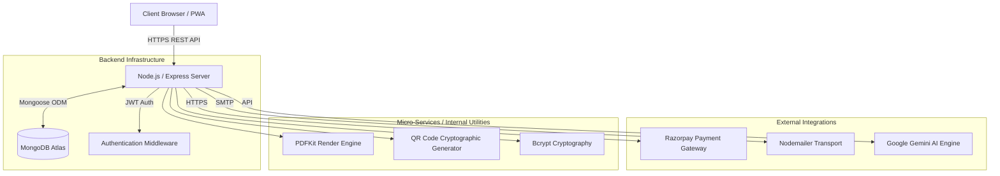
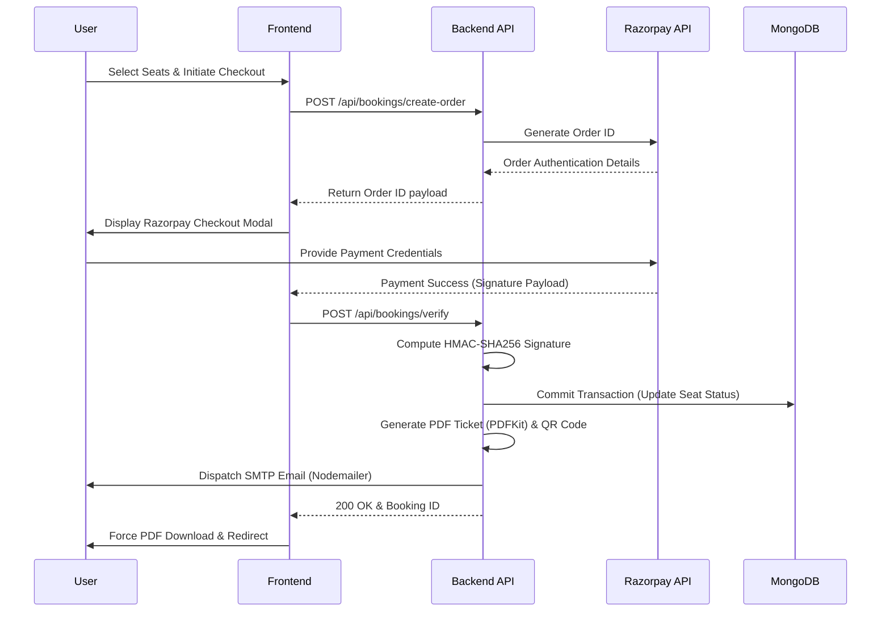
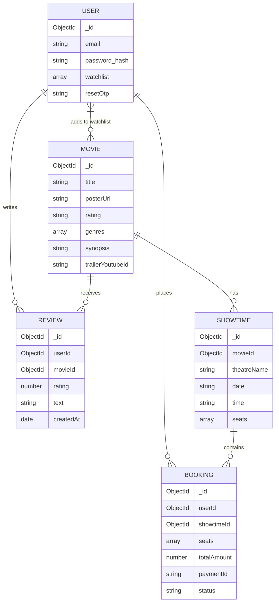

# CINEMAX: Enterprise Movie Ticketing Platform

**ACA Summer Project End Evaluation: ACA253**

CINEMAX is a highly scalable, robust, and enterprise-grade movie ticketing and theater management platform. Developed as the definitive capstone for the ACA summer project end evaluation, this system demonstrates mastery over advanced software engineering principles, full-stack JavaScript development, cryptographic security, and complex integrations with modern third-party APIs.

---

## 1. Executive Summary

The CINEMAX platform is engineered to handle high-concurrency booking transactions while maintaining strict ACID compliance at the database level. It abstracts the complexity of theater seat management, secure payment processing, automated document generation, and personalized content delivery into a seamless, high-performance web interface.

---

## 2. Architectural Topology

The system adheres to a strictly decoupled Client-Server architecture, ensuring high cohesion and low coupling. 

### 2.1 System Architecture


### 2.2 Transaction Sequence Flow
The booking engine handles concurrency and payment validation securely without exposing sensitive keys to the client.



---

## 3. Database Schema Design

The application utilizes MongoDB Atlas with a strictly typed schema using Mongoose. The database is heavily normalized where appropriate, utilizing Object References to maintain data integrity.



---

## 4. Security & Authentication Protocol

Security is implemented at multiple layers of the application stack:

1. **Authentication:** Stateless authentication utilizing JSON Web Tokens (JWT). Tokens are heavily encrypted and assigned strict expiration times.
2. **Password Cryptography:** All user credentials are computationally hashed using `bcryptjs` with a high salt round configuration, mitigating rainbow table and brute-force attacks.
3. **Payment Integrity:** Razorpay webhooks and client callbacks are verified server-side using cryptographic HMAC-SHA256 signatures to prevent payload tampering and spoofing.
4. **Data Validation:** Mongoose schemas enforce strict type-checking and validation rules before database commits.
5. **Route Protection:** Express middleware intercepts protected routes, verifying the Authorization Bearer token before proceeding to the controller logic.

---

## 5. RESTful API Documentation

### User Identity Management
- `POST /api/users/signup`: Registers a new user and hashes credentials.
- `POST /api/users/signin`: Authenticates credentials and issues a JWT.
- `POST /api/users/forgot-password`: Generates a time-sensitive OTP.
- `POST /api/users/reset-password`: Validates OTP and updates credential hashes.

### Movie & Content Delivery
- `GET /api/movies`: Retrieves the global movie catalog.
- `GET /api/movies/:id`: Retrieves detailed metadata, computes the dynamic aggregate rating (`$avg`), and populates associated reviews.
- `GET /api/movies/search?query=...`: Performs highly optimized Regular Expression (`$regex`) filtering on the database.

### Transaction Engine
- `POST /api/bookings/create-order`: Interfaces with Razorpay to generate a secure transaction order.
- `POST /api/bookings/verify`: The critical transaction commit endpoint. Verifies HMAC signatures, updates the seat matrix, locks the seats, and initiates document generation.
- `GET /api/bookings/:id/ticket`: Streams a dynamically generated PDF buffer directly to the client.

### Community & Social
- `POST /api/reviews`: Validates duplicate review logic and commits a new rating.

---

## 6. Advanced Feature Implementations

### 6.1 Dynamic PDF Ticket Generation (Phase 2)
Upon successful payment, the server does not rely on static files. It utilizes `pdfkit` to allocate memory buffers, paints a vector-based layout of a movie ticket, encodes the unique Booking ID into a Base64 QR Code (`qrcode`), and streams the binary output to the client while simultaneously attaching it to an SMTP email payload via `nodemailer`.

### 6.2 Artificial Intelligence Integration (Phase 3)
The platform is designed to ingest the user's view history and watchlist, passing this normalized dataset to the **Google Gemini API**. The LLM processes the behavioral data to output highly personalized, context-aware movie recommendations, moving beyond simple genre-overlap algorithms.

### 6.3 Concurrency & State Management
The visual seat map maintains state via strict DOM manipulation and synchronization with the MongoDB `Showtime` documents. Seats are categorized strictly into `Regular`, `Premium`, and `Recliner`, dynamically calculating totals before payload transmission.

---

## 7. Exhaustive Technology Stack

### Frontend Engineering
- **Core Languages:** HTML5, CSS3, ES6+ JavaScript.
- **Architectural Paradigm:** Vanilla JS Component Architecture (No heavy frameworks, ensuring 0ms hydration times).
- **Styling:** Custom Design Tokens, CSS Variables, Flexbox/Grid Layouts.
- **Storage:** Web Storage API (Local/Session).

### Backend Engineering
- **Runtime:** Node.js (V8 Engine).
- **Framework:** Express.js (REST API architecture).
- **Cryptography:** Node `crypto` module, `bcryptjs`, `jsonwebtoken`.
- **Media Generation:** `pdfkit` (PDF generation), `qrcode` (2D Barcodes).
- **Network:** `nodemailer` (SMTP Transport), `cors`.

### Database Architecture
- **Engine:** MongoDB Atlas (NoSQL).
- **ODM:** Mongoose.
- **Data Structures:** Embedded arrays for Seat Matrices, ObjectIds for Relational mapping.

---

## 8. Installation & Deployment Guide

### System Requirements
- Node.js Environment (v18.0.0+)
- NPM or Yarn Package Manager
- MongoDB Atlas Cluster Instance
- Razorpay Merchant Account (Test Mode)

### Step-by-Step Initialization

1. **Clone the Repository**
   ```bash
   git clone https://github.com/YourOrg/CINEMAX.git
   cd CINEMAX/server
   ```

2. **Environment Configuration**
   Create a `.env` file at the root of the `/server` directory. This file must never be committed to version control.
   ```text
   PORT=5000
   MONGO_URI=<Your MongoDB Connection String>
   JWT_SECRET=<High Entropy Cryptographic String>
   RAZORPAY_KEY_ID=<Razorpay Test Key>
   RAZORPAY_KEY_SECRET=<Razorpay Test Secret>
   ```

3. **Dependency Resolution**
   ```bash
   npm install
   ```

4. **Database Seeding**
   Start the server and navigate to `http://localhost:5000/api/movies/upload` and `http://localhost:5000/api/showtimes/seed` to initialize the database architecture.

5. **Server Ignition**
   ```bash
   node server.js
   ```

The enterprise API will successfully mount on `http://localhost:5000`, and the static frontend client will be served automatically.
